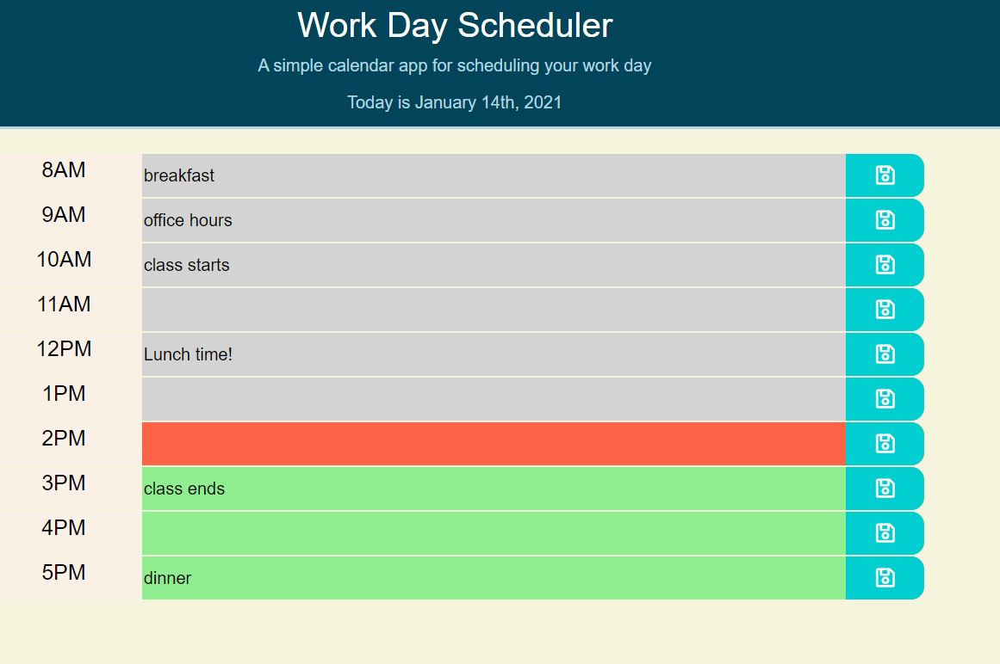

# Workday Scheduler
A simple calendar app for scheduling your workday.

## Deployed Link

https://mesgt.github.io/Day_Planner/

 
 

# Application Details

## Purpose

This app was developed to help the user track the events throughout their workday. 

## Description

Keeping track of a busy schedule can be difficult. This simple calendar application  allows a user to save events for each hour of the day by modifying starter code. This app runs in the browser and features dynamically updated HTML and CSS powered by jQuery. 

For user's convenience, the current time is identified with red, past events with grey and upcoming appointments with green. Save button to the right of each item can be used to save the initial entry or its modification.

[Moment.js](https://momentjs.com/) library was used to work with dates and times. Note: `Moment.js` has historically been the most popular date/time library but is no longer supported by its developers. 

## Technologies

<li>jQuery 
<li>Moment.js

## Future Development

Ideas for future development include:
1. Option to extend work hours
2. Block out certain times as personal time
3. Add alerts when an appointment is approaching

## License

Licensed under the [MIT](https://opensource.org/licenses/MIT) license.

## GitHub

https://github.com/mesgt/Day_Planner

## Contributing

I would like to welcome you to work with me on improving this project. Feel free to contact me on gitHub or submit a pull request.

Please note that this project is released with a Contributor Code of Conduct. 
By participating in this project you agree to abide by its terms. 

If you are interested in collaborating with me on this project, please visit (https://www.contributor-covenant.org/version/2/0/code_of_conduct/) to review the latest version of Contributor Covenant. In Node.js, please run the following command "npm install -g covgen" and "covgen '<your_email_address>'". If you have npm 5.x installed you can run npx covgen <your_email_address> instead of installing globally.
